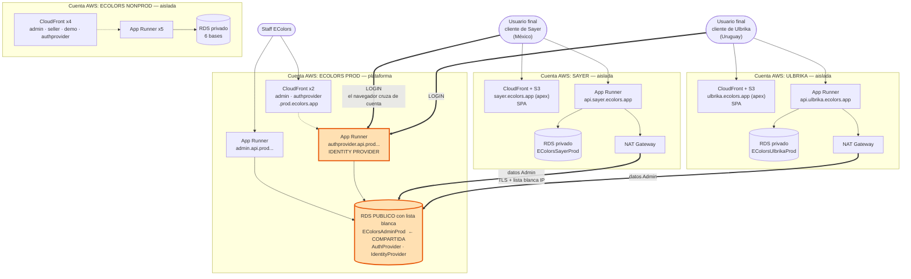
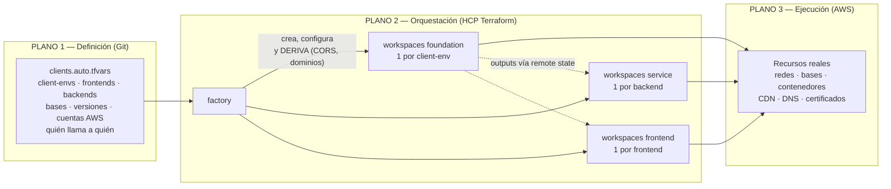
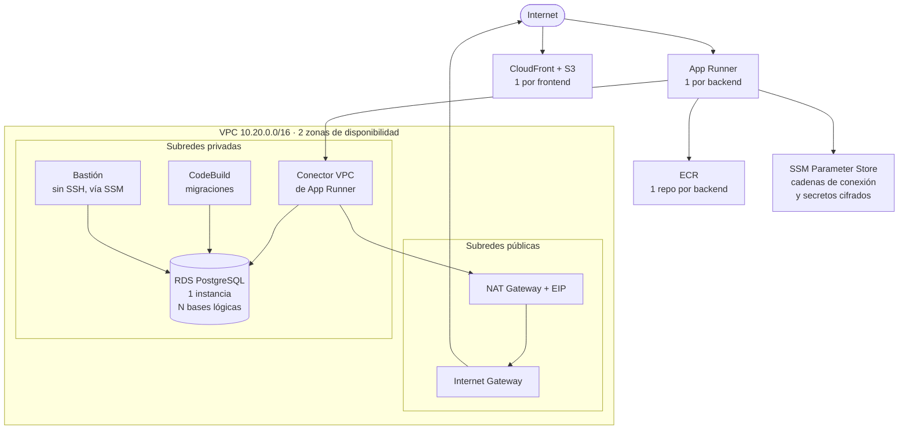
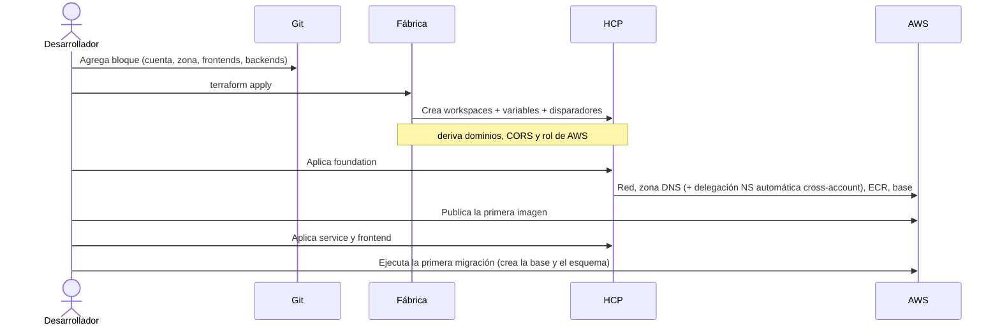
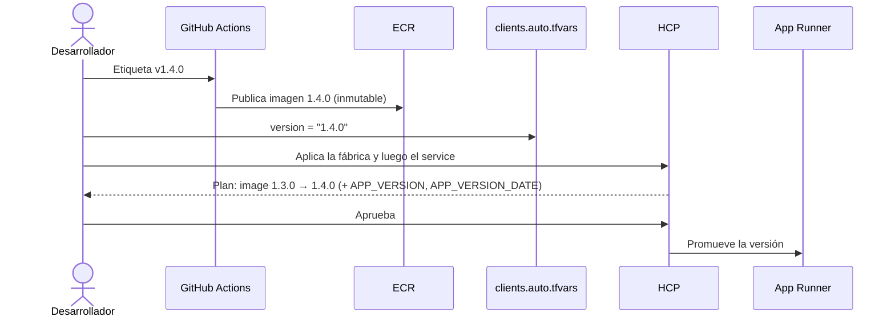

# 01 — Visión general de la arquitectura

> **Documento 1 de la serie de arquitectura.** Describe *qué* se construyó, *por qué* se eligió
> cada pieza y *cómo* responde a los atributos de calidad (mantenibilidad, costos, performance,
> seguridad, interoperabilidad, disponibilidad).

## 0. Cómo leer este documento

Está escrito **sin dar por sabido nada**. Cada término técnico se define la primera vez que
aparece. Si ya conocés un concepto, saltealo sin culpa.

| Sección | Para qué sirve |
|---|---|
| 1. Resumen ejecutivo | Entender el sistema en 2 minutos |
| 2. Glosario base | Los conceptos que se usan en todo el resto |
| 3. Objetivos | Qué problemas resuelve y cómo se verifica que los resuelve |
| 4–6. Vistas y diagramas | El sistema de lo general a lo particular |
| 7. Catálogo de servicios | Qué es cada servicio, para qué se usa acá y **por qué ese y no otro** |
| 8. Flujos operativos | Cómo se opera en el día a día |
| 9. Atributos de calidad | Los seis ejes pedidos, con sus concesiones explícitas |
| 10. Limitaciones | Lo que **no** está resuelto (leelo antes de producción) |

---

## 1. Resumen ejecutivo

Se construyó una **plataforma reutilizable para desplegar APIs y frontends web en AWS**, donde
**cada cliente vive aislado en su propia cuenta de AWS**, y donde dar de alta un cliente, una API
o un frontend consiste en **editar un archivo de texto y ejecutar un comando**.

Los cinco pilares:

1. **Una única fuente de verdad.** `factory/clients.auto.tfvars` declara todos los clientes, sus
   frontends, sus backends, sus bases de datos, sus versiones, quién le habla a quién y en qué
   cuenta de AWS vive cada uno.
2. **Una "fábrica" que estampa infraestructura.** De ese archivo se generan automáticamente todos
   los entornos de trabajo y sus variables. No se configura nada a mano.
3. **Aislamiento por cliente**, impuesto por la herramienta: cada cliente tiene su cuenta de AWS,
   su red, su base de datos y su dominio, y un despliegue con credenciales de otra cuenta
   **falla** en vez de crear recursos donde no corresponde.
4. **Sin credenciales de larga vida.** Ni las tuberías de integración continua ni el motor de
   despliegue guardan claves de AWS: todo se autentica con identidad federada y credenciales
   temporales.
5. **Relaciones declaradas, configuración derivada.** Cada frontend declara a qué backends le
   pega; la plataforma **calcula sola** los permisos de navegador (CORS) que eso implica, incluso
   cuando cruzan cuentas de AWS.

**Estado actual:** 4 client-envs · 4 cuentas de AWS · 9 backends · 8 frontends · 11 bases de datos
· 4 instancias RDS · 8 distribuciones de CDN.

---

## 2. Glosario base

### 2.1 Sobre infraestructura como código

**Infraestructura como código (IaC).** En vez de crear servidores y bases haciendo clic en una
consola web, se **describen en archivos de texto** versionados en Git. La infraestructura pasa a
ser reproducible, revisable y auditable, igual que el código.

**Terraform.** La herramienta de IaC que se usa acá. Lee archivos `.tf`, los compara con lo que
existe realmente en la nube y calcula un **plan**: la lista de cambios necesarios. Recién cuando
alguien lo aprueba, lo ejecuta (**apply**).

**Estado (*state*).** El archivo donde Terraform recuerda qué recursos creó. Es lo que le permite
saber que "esta base que existe en AWS es la que yo creé", y así distinguir entre crear una nueva
y modificar la existente.

**Proveedor (*provider*).** El complemento que le enseña a Terraform a hablar con un servicio.
Acá se usan tres: `aws`, `tfe` (crear entornos de trabajo en el motor de despliegue) y `time`.

**Módulo.** Un paquete reutilizable de código Terraform. El módulo `database` sabe crear una base
con su red, su cifrado y sus credenciales; se lo invoca una vez por cliente en vez de copiar y
pegar.

**Stack.** Una unidad desplegable: módulos que se aplican juntos y comparten un estado. Acá hay
tres: `foundation`, `service` y `frontend`.

**HCP Terraform** (antes *Terraform Cloud*). El servicio gestionado que **ejecuta** Terraform y
**guarda los estados** de forma centralizada y cifrada, en vez de que cada persona lo corra desde
su máquina. Aporta control de acceso, historial y aprobación de planes.

**Workspace (entorno de trabajo).** Un stack + su estado + sus variables. Es la unidad que se
aprueba y se aplica.

**Remote state (estado remoto).** El mecanismo por el cual un workspace **lee las salidas de
otro**. Es cómo un backend se entera de en qué red entrar sin que nadie copie identificadores a
mano. **Dato clave:** opera a nivel de la *organización* de HCP, **no** de la cuenta de AWS — por
eso permite compartir información entre cuentas distintas sin configurar permisos entre ellas.

**Run trigger (disparador).** "Cuando el workspace A se aplique, encolá una ejecución de B".
Mantiene el orden de despliegue automáticamente.

### 2.2 Sobre redes en AWS

**VPC.** Una red privada y aislada dentro de una cuenta de AWS. Nada de lo que está adentro es
alcanzable desde internet salvo que se habilite explícitamente.

**CIDR.** La notación para un rango de IPs, ej. `10.20.0.0/16` (≈65.000 direcciones).

**Subred.** Una porción de la VPC, atada a una **zona de disponibilidad**.
- **Pública:** tiene ruta directa a internet.
- **Privada:** no la tiene. Es donde viven las bases y lo sensible.

**Zona de disponibilidad (AZ).** Un centro de datos físicamente separado dentro de una región.
Repartir recursos entre varias AZ es lo que da tolerancia a la caída de un centro de datos.

**Internet Gateway (IGW).** La puerta de la VPC hacia internet, usada por las subredes públicas.

**NAT Gateway.** Permite que lo que está en una subred **privada** *salga* a internet **sin
volverse alcanzable desde afuera**. Como llamar por teléfono desde casa: podés llamar, no pueden
llamarte. Tiene una IP pública fija (**EIP**) que es la que ve el mundo — ese detalle es
importante más adelante.

**Security Group (SG).** Un cortafuegos a nivel de recurso: quién puede conectarse y a qué
puerto. Puede referirse a **otro grupo de seguridad** en vez de a IPs, lo cual es más robusto:
"permito a cualquier cosa que lleve la etiqueta *db-clients*".

### 2.3 Sobre DNS y certificados

**Zona alojada.** El contenedor donde se administran los nombres de un dominio, ej.
`sayer.ecolors.app`.

**Delegación NS.** Para que una zona funcione, el dominio padre (`ecolors.app`) debe apuntar a
los servidores de nombres de la zona hija. Es un paso **manual y único** por cliente.

**Registro CNAME.** Un alias de un nombre a otro nombre. **Limitación clave:** el estándar DNS
**no permite** un CNAME en la raíz del dominio (el *apex*, ej. `sayer.ecolors.app` sin prefijo).

**Registro ALIAS.** Extensión de Route 53 que *sí* funciona en el apex y apunta a un recurso de
AWS. **Esta distinción explica una decisión central:** los backends van en subdominio porque su
servicio solo admite CNAME; los frontends pueden ocupar el apex porque el suyo admite ALIAS.

**TLS / certificado.** Lo que habilita `https://`. **ACM** los emite y **renueva
automáticamente**, gratis.

### 2.4 Sobre contenedores, secretos y navegador

**Contenedor / imagen.** Una imagen es un paquete inmutable con la aplicación y sus dependencias;
un contenedor es una imagen en ejecución. Elimina el "en mi máquina funciona".

**Etiqueta inmutable.** Una vez publicada, `1.4.0` **no se puede sobrescribir**: una versión
significa siempre exactamente el mismo binario.

**Federación de identidad / OIDC.** Un estándar por el cual un sistema externo (GitHub, HCP)
demuestra su identidad ante AWS y recibe credenciales **temporales**, en vez de guardar una clave
permanente. Elimina la categoría entera de incidentes "se filtró una clave de AWS".

**CORS.** Una regla que aplica **el navegador**: si una página cargada en el origen A quiere
llamar por HTTP al origen B, B debe declarar explícitamente que acepta a A. No es una regla de
red ni de IAM — es del navegador, y es invisible hasta que falla en el cliente.

**SPA (*Single Page Application*).** Una aplicación web que se descarga como archivos estáticos y
después habla con las APIs desde el navegador. Su URL de API se fija **al compilar**.

---

## 3. Objetivos y cómo se alcanzaron

| # | Objetivo | Cómo se logró | Cómo se verifica |
|---|---|---|---|
| 1 | Alta de cliente/app/frontend sin trabajo manual | La fábrica genera todos los workspaces y variables desde un archivo | Agregar un bloque y aplicar la fábrica |
| 2 | Aislar clientes entre sí | Cuenta de AWS + VPC + base + dominio propios | `allowed_account_ids` hace **fallar el plan** con credenciales de otra cuenta |
| 3 | Despliegues predecibles y auditables | La versión a ejecutar se declara en Git; el plan muestra el cambio exacto | Un cambio de versión produce un plan mínimo |
| 4 | Eliminar credenciales de larga vida | OIDC en ambos sentidos (GitHub→AWS y HCP→AWS) | No hay ninguna clave de AWS en Git ni en variables |
| 5 | Secretos fuera del repositorio | Valores en variables sensibles, materializados cifrados | En Git solo están los *nombres* de los secretos |
| 6 | Compartir datos entre clientes de forma controlada | Base compartida explícita con lista blanca de IP de origen | Solo las IP declaradas pueden conectarse |
| 7 | Frontends con dominio propio, incluido el apex | CDN + registros ALIAS; dominio derivado por convención | `https://<dominio>` responde la aplicación |
| 8 | **Que agregar un frontend no rompa el login** | CORS **derivado** de las relaciones declaradas | Un frontend nuevo aparece solo en los origins permitidos |
| 9 | Reducir el costo de mantener el sistema | Módulos reutilizados; 3 stacks; decisiones registradas | Un cambio transversal se hace en un módulo |

---

## 4. Vista general: quién le pega a qué



**Las tres lecturas del diagrama:**

1. **Las flechas gruesas son el único acoplamiento entre clientes.** Todo lo demás está duplicado
   y aislado por cuenta.
2. **El usuario final SÍ cruza de cuenta — en el login.** Al autenticarse, el navegador del
   cliente de Sayer le pega directamente al *identity provider* que vive en la cuenta de EColors.
   Solo después habla con la API de su propio cliente. Esto es lo que obliga a que el CORS de
   `authprovider-webapi` acepte los orígenes de **todos** los licenciatarios.
3. **`ecolors-prod` no es un cliente más: es la plataforma.** Dos cosas dependen de ella para
   todos — la base `EColorsAdminProd` y el identity provider. Si cae, **nadie puede loguearse en
   ningún licenciatario**.

---

## 5. Los tres planos del sistema



**Por qué importa la separación:** la fábrica **no crea infraestructura en AWS**, solo configura
workspaces. Eso acota su radio de daño: un error ahí desconfigura entornos de trabajo, no borra
bases de datos.

La fábrica además **deriva** información que sería tediosa y peligrosa de mantener a mano:
- el **dominio** de cada frontend (`<name>.<zona>`, o el apex),
- los **orígenes CORS** de cada backend, invirtiendo las relaciones declaradas,
- el **rol de AWS** que asume cada workspace, a partir de la cuenta declarada.

### Los tres stacks y por qué son tres

| Stack | Alcance | Contiene | Frecuencia de cambio |
|---|---|---|---|
| **foundation** | 1 por client-env | Red, bastión, zona DNS, identidad federada, registros de imágenes, **base compartida** | Muy baja |
| **service** | 1 por backend | Contenedor en ejecución, dominio, ejecutor de migraciones | Alta (cada release) |
| **frontend** | 1 por frontend | Bucket, CDN, certificado, DNS | Baja |

El criterio es **frecuencia de cambio × alcance compartido**. Un despliegue diario de una API
planifica solo contra su stack: **no puede** tocar la red ni la base, porque viven en otro estado.

---

## 6. Anatomía de un client-env



**Recorrido de una petición.** El usuario llega por HTTPS a App Runner (que termina el TLS con un
certificado que gestiona solo). La aplicación sale por el **conector VPC** hacia las subredes
privadas y llega a RDS **sin pasar por internet**. Para algo externo, sale por el NAT.

**Por qué el bastión no tiene SSH.** Para administrar la base, en vez de exponer un servidor con
clave SSH y puerto abierto, hay una máquina **sin IP pública y sin ninguna regla de entrada**. El
acceso se hace con **SSM Session Manager**: AWS abre el túnel desde adentro, autenticando con
IAM. No hay puerto que atacar ni clave que se filtre. Además exige **IMDSv2**, que mitiga una
familia conocida de ataques de robo de credenciales de instancia.

---

## 7. Catálogo de servicios: qué es, para qué acá, por qué ese

### 7.1 Cómputo de los backends — **AWS App Runner**

**Qué es.** Toma una imagen de contenedor y la ejecuta expuesta por HTTPS, gestionando por sí solo
el balanceador, el certificado TLS, el autoescalado y los chequeos de salud.

**Por qué este y no otro.**

| Alternativa | Por qué se descartó |
|---|---|
| **ECS + Fargate** | Hay que construir y mantener a mano balanceador, grupos de destino, certificado, reglas de escalado y definiciones de tarea. Más piezas para el mismo resultado. |
| **EKS (Kubernetes)** | Implica operar un clúster: actualizaciones, complementos de red, control de acceso. Costo operativo desproporcionado para 9 APIs. |
| **Lambda** | Excelente para eventos, incómodo para APIs .NET de larga vida: arranques en frío, límites de tiempo, modelo de programación distinto. |
| **EC2** | Habría que administrar sistema operativo, parches y escalado. Es un retroceso. |

**La concesión.** Menos control fino y **disponibilidad limitada a ciertas regiones** — esto
último tiene consecuencias reales de latencia (ver 9.3).

### 7.2 Base de datos — **Amazon RDS for PostgreSQL**

**Para qué acá.** **Una instancia por client-env** con **varias bases lógicas**, una por backend.

**Por qué compartida y no una por backend.** Nueve backends habrían significado nueve instancias:
nueve costos fijos y nueve ventanas de mantenimiento. El aislamiento que importa es **entre
clientes**, no entre backends del mismo cliente. Se conserva el aislamiento **de datos** (cada uno
con su base y su cadena de conexión) sacrificando el **de instancia**.

**Por qué RDS y no Aurora.** Aurora da mejor rendimiento y réplicas más rápidas, con mayor costo
base. Para el volumen actual, `db.t4g.micro` alcanza. *Aurora Serverless v2* es el camino natural
si la carga crece de forma irregular.

**Configuración:** PostgreSQL 16.8, `gp3` con crecimiento automático 20→100 GB, cifrado en reposo,
**TLS obligatorio**, 7 días de copias, protección contra borrado.

### 7.3 Registro de imágenes — **Amazon ECR**

Un repositorio por backend (`{cliente}-{app}-{entorno}`), creado por `foundation`.

**Por qué etiquetas inmutables.** Es lo que hace posible el modelo de promoción: si `1.4.0` no
puede sobrescribirse, "desplegar 1.4.0" significa siempre el mismo binario, y el plan de Terraform
es una verdad verificable.

### 7.4 Secretos — **SSM Parameter Store** (+ Secrets Manager)

Guarda las cadenas de conexión y los secretos de aplicación, cifrados con KMS. App Runner los
inyecta como variables de entorno **en el arranque**, ya descifrados.

**Por qué Parameter Store y no Secrets Manager para todo.** Secrets Manager agrega rotación
automática y cuesta por secreto por mes; `SecureString` es gratuito en su nivel estándar y cubre
el caso. Secrets Manager se usa **solo para la credencial maestra**, donde la rotación sí tiene
sentido a futuro.

### 7.5 Migraciones — **AWS CodeBuild dentro de la VPC**

**Por qué así.** La base **no es alcanzable desde internet** (esa es la idea), así que el proceso
que corre las migraciones debe ejecutarse desde adentro de la red. Las alternativas —abrir la base
al mundo o usar un túnel manual— sacrifican seguridad o repetibilidad. GitHub Actions dispara el
trabajo con identidad federada, sin claves.

### 7.6 Frontends — **S3 + CloudFront + ACM + Route 53**

- **S3:** guarda los archivos compilados del sitio.
- **CloudFront:** red de distribución (CDN); copia los archivos cerca del usuario.
- **OAC:** el mecanismo por el cual **solo** CloudFront puede leer el bucket, firmando cada
  petición al origen.

**Por qué el bucket es privado.** Cuatro capas lo impiden hacer público: bloqueo de acceso
público, ACLs deshabilitadas, política que solo autoriza al servicio de CloudFront, y una
condición que la restringe **a esa distribución concreta**. Ir directo a la URL de S3 da `403`.

**Por qué esto permite ocupar el apex.** CloudFront se referencia con un registro **ALIAS**, que
sí es válido en la raíz del dominio.

**Detalle no obvio:** como la política no concede permiso de *listar* el bucket, una ruta
inexistente devuelve **403 y no 404**. Por eso la distribución traduce **ambos** códigos a
`/index.html` con estado 200 — sin eso, recargar una ruta interna de la SPA rompería.

**Convención de dominios.** Frontend en `<name>.<zona>`, backend en `<app>.api.<zona>`. El
frontend que lleve `serve_on_zone_root = true` responde en la zona misma (uno solo por client-env).

### 7.7 Identidad y acceso — **IAM + OIDC**

Dos federaciones: **GitHub Actions → AWS** (publicar imágenes, disparar migraciones) y **HCP
Terraform → AWS** (desplegar). El ARN del rol que asume cada workspace es lo que **determina en
qué cuenta despliega**, y se declara en `clients.auto.tfvars`.

**Por qué no claves de acceso.** Una clave estática es un secreto permanente que hay que
almacenar, rotar y que puede filtrarse. Con OIDC, el proveedor emite un token de vida corta que
AWS canjea por credenciales temporales. **No hay nada que robar.**

---

## 8. Flujos operativos

### 8.1 Alta de un cliente nuevo



**El único paso manual por cliente:** la **primera imagen** (App Runner no arranca contra un
registro vacío). La **delegación DNS de cada cliente es automática** — la foundation escribe sus NS
en la zona padre asumiendo el rol `dns-delegation`. Lo único manual en DNS es el setup **único** del
registrador (GoDaddy → `ecolors.app`), no por cliente.

### 8.2 Publicar una versión de un backend



**Por qué el despliegue automático está desactivado.** App Runner puede redesplegar solo al
detectar una imagen nueva. Se **apagó** a propósito: si no, la versión en ejecución dependería de
quién publicó último y no de lo declarado en Git. Con esto apagado, **Git es la verdad**.

### 8.3 CORS derivado (por qué agregar un frontend no rompe el login)

Cada frontend declara a qué backends le pega desde el navegador. La fábrica **invierte** esa
relación y le inyecta a cada backend sus orígenes permitidos:

```
FE admin (https://admin.prod.ecolors.app) → llama a admin-webapi y authprovider-webapi
FE sayer (https://sayer.ecolors.app)      → llama a webapi (sayer) y authprovider-webapi (ecolors)
FE ulbrika (https://ulbrika.ecolors.app)  → idem
                       ↓ la fábrica invierte
authprovider-webapi recibe:
  Cors__AllowedOrigins__0 = https://admin.prod.ecolors.app
  Cors__AllowedOrigins__1 = https://authprovider.prod.ecolors.app
  Cors__AllowedOrigins__2 = https://sayer.ecolors.app      ← otra cuenta AWS
  Cors__AllowedOrigins__3 = https://ulbrika.ecolors.app    ← otra cuenta AWS
```

**Por qué esto es importante.** CORS es una regla del navegador: no falla en el plan, no falla al
desplegar — falla **en el cliente, en producción**, cuando alguien intenta loguearse. Mantenerlo a
mano en tres cuentas distintas es garantía de olvido. Derivarlo hace que un licenciatario nuevo
aparezca solo en la lista blanca del identity provider.

---

## 9. Atributos de calidad

### 9.1 Mantenibilidad

**A favor.**
- **Una sola fuente de verdad**: client-envs, frontends, backends, bases, versiones, cuentas y
  relaciones, todo en un archivo.
- **Configuración derivada, no duplicada**: dominios, orígenes CORS y roles de AWS se calculan.
  Lo que no se escribe a mano, no se desincroniza.
- **Módulos reutilizados**: un cambio transversal se hace una vez.
- **Validaciones como red de contención** (9 en total): cuenta mal formada, nombres duplicados,
  referencias a cosas que no existen, más de un frontend en el apex, migrar una base ajena.
- **Decisiones registradas (ADRs)**: siete documentos explican *por qué*.
- **Versiones fijadas**: cada workspace apunta a una **etiqueta de Git**, nunca a una rama.

**En contra.**
- **La fábrica concentra riesgo**: un `apply` equivocado ahí reconfigura muchos workspaces.
- **Nada se ha validado ni aplicado todavía.**

### 9.2 Costos

> **Estimaciones detalladas por cliente y ambiente en
> [`costos.md`](./costos.md)** — incluye precios unitarios, supuestos y palancas de optimización.

**Qué mueve realmente la aguja** (≈ **305 USD/mes en reposo** para los 4 client-envs):

| Factor | Comportamiento | % del total en reposo |
|---|---|---:|
| **NAT Gateway** | Costo fijo por hora **por VPC** + por GB | **43 %** — la mayor línea |
| **App Runner** | Memoria aprovisionada de forma continua + vCPU solo cuando hay tráfico | 30 % (alcanza al NAT con carga sostenida) |
| **RDS** | Costo fijo por instancia | 18 % — se redujo de 9 a 4 instancias al compartirlas por client-env |
| **Bastión** | Instancia mínima encendida siempre | 5 % |
| **CDN, S3, ECR, DNS, secretos** | Por uso; muy bajos a esta escala | 4 % |

**Dos hallazgos del análisis de costos:**
- **El ambiente de NO producción es el más caro** (≈ $106/mes contra ≈ $74 de `ecolors-prod`):
  tiene 5 backends contra 2, **con el mismo dimensionamiento que producción**.
- **Cada licenciatario nuevo cuesta ≈ $63/mes de piso**, de los cuales **$51 son fijos** e
  independientes del uso. Es el precio explícito del aislamiento por cliente (ADR 0001), y
  conviene tenerlo presente al fijar el precio del licenciamiento.

**Aclaración importante sobre el NAT.** Se cobra **por VPC**, y la cantidad de VPCs la determina
la cantidad de **client-envs**, no de cuentas de AWS. Separar `ecolors-prod` y `ecolors-nonprod`
en cuentas distintas **no agregó ningún NAT**: ya eran dos foundations, o sea dos VPCs. Del mismo
modo, **volver a unir las cuentas no ahorraría nada**; solo ahorraría unir las **VPCs**, y eso
pondría cargas de nonprod en la misma red que los datos de producción (ver 9.4).

**Optimizaciones ya aplicadas:** una base por client-env en vez de una por backend, instancias
pequeñas por defecto, limpieza automática del registro de imágenes, un solo NAT por VPC.

**Optimizaciones disponibles y no aplicadas:**
- **Apagar el NAT donde no haga falta** (`enable_nat = false`). Sayer y Ulbrika lo necesitan (van
  al RDS público de EColors); los de EColors quizá no, salvo por CodeBuild.
- **VPC Endpoints**: el *gateway* de S3 es **gratis** y cubre buena parte del tráfico (las capas
  de imágenes de ECR viven en S3). Los de interfaz tienen costo por hora, así que hay que medir.
- Ojo: si las migraciones bajan paquetes públicos de NuGet, CodeBuild **necesita** salida a
  internet.

### 9.3 Performance

**A favor.** Autoescalado automático; CDN sirviendo los frontends desde el borde; base alcanzada
por red privada; compresión y caché agresiva de los archivos con hash, dejando `index.html` sin
caché para que un despliegue se vea al instante.

**Dos observaciones concretas, con la geografía real de los usuarios:**

1. **La clase de precio del CDN excluye Sudamérica.** `PriceClass_100` cubre Norteamérica y
   Europa. **México entra** en el grupo norteamericano de CloudFront, así que el frontend de
   **Sayer está bien servido**. Pero el de **Ulbrika (usuarios en Uruguay) no**: se serviría desde
   bordes de EE.UU. Para ese frontend conviene `PriceClass_All`, que incluye bordes sudamericanos.
2. **Todo está desplegado en `us-east-1`.** Para México el viaje de ida y vuelta es tolerable;
   **para Uruguay ronda los 120–160 ms en cada llamada a la API** (que no pasa por CDN). Si la SPA
   encadena varias peticiones al abrir una pantalla, es un segundo o más de puro tiempo de red.

**Por qué no se resuelve simplemente moviendo Ulbrika a São Paulo.** Dos frenos:
- **App Runner no está disponible en todas las regiones** — verificar `sa-east-1` antes de
  planear cualquier movimiento.
- **Más decisivo: la base `EColorsAdminProd` vive en `us-east-1`.** Mover el cómputo de Ulbrika a
  São Paulo ganaría ~120 ms en el request del usuario, pero **pagaría ~120 ms en cada consulta a
  Admin**, que suelen ser secuenciales. El resultado neto puede ser peor.

  **Consecuencia arquitectónica a registrar:** la decisión de tener una base compartida (ADR 0007)
  **ancla geográficamente a todos los licenciatarios** a la región donde vive esa base.

**El camino razonable** para Ulbrika sin mover nada de región es poner **CloudFront delante de la
API**: el establecimiento de conexión (TCP + TLS son varios viajes) termina en un borde cercano y
solo el request viaja el tramo largo, por la red troncal de AWS. **Medir primero**, con la
latencia real desde Uruguay, antes de construir nada.

### 9.4 Seguridad

**A favor.**
- **Sin credenciales de larga vida** en toda la cadena de despliegue.
- **Barrera de cuenta**: `allowed_account_ids` hace **fallar el plan** con credenciales de otra
  cuenta. El aislamiento por cliente lo impone la herramienta, no la disciplina.
- **Bases privadas por defecto**, con TLS obligatorio.
- **Administración sin puertos abiertos** (bastión por SSM, IMDSv2).
- **Cifrado en reposo** en base, objetos y discos.
- **Secretos fuera de Git**: el repositorio guarda los *nombres*; los valores viven cifrados.
- **Frontends con origen cerrado** (bucket solo legible por su propia distribución).
- **CORS derivado**: no depende de que alguien se acuerde de actualizarlo.

**En contra — leer con atención.**

- **Todo se conecta con el usuario maestro de PostgreSQL, y eso cruza cuentas.** Esta es la
  deuda más grave. La cadena de conexión que Sayer recibe de EColors contiene el **usuario
  maestro del RDS de `ecolors-prod`**, no un usuario acotado a `EColorsAdminProd`. En la práctica:
  **la cuenta de Sayer tiene credenciales maestras sobre la base de producción de EColors**,
  incluidas `AuthProvider` e `IdentityProvider`. Una inyección SQL o un RCE en la app de un
  licenciatario no compromete a ese licenciatario: compromete **la identidad de toda la
  plataforma**.

  Aclaración necesaria: **crear usuarios por aplicación no alcanza por sí solo**. En PostgreSQL
  cualquier rol puede conectarse a cualquier base por defecto (el rol `PUBLIC` tiene `CONNECT`).
  La mitigación real es *usuarios dedicados + `REVOKE CONNECT ... FROM PUBLIC` + `GRANT` mínimo*,
  y para el consumidor externo, permisos de solo lectura sobre la única base que necesita.

- **La instancia de producción de EColors es pública.** Protegida por lista blanca de IP y TLS,
  pero expone **toda la instancia**, no solo la base compartida.
- **El secreto compartido se propaga**: queda en el estado del proveedor y en el de cada
  consumidor.
- **Unir las VPCs de prod y nonprod agravaría todo lo anterior.** Como el acceso se concede por el
  grupo de seguridad compartido `db_clients`, cualquier App Runner de esa VPC —incluidos los de
  nonprod— alcanzaría a nivel de red la base de producción. Sumado al usuario maestro, sería
  acceso completo desde el entorno menos controlado.

### 9.5 Interoperabilidad

**Contratos explícitos y acotados.** El stack de un backend lee un conjunto conocido de salidas de
su `foundation`. Nada más.

**Convenciones de la aplicación.** El contenedor cumple un contrato mínimo: escuchar en un puerto,
exponer `/health`, y leer su configuración de variables de entorno con el formato jerárquico de
.NET (`Seccion__Clave`). La infraestructura inyecta cadenas de conexión, configuración, versión y
**orígenes CORS** sin que la aplicación sepa nada de AWS.

**Estándares abiertos.** OIDC, PostgreSQL, OCI, DNS, TLS y CORS. Nada exótico: migrar a otro
proveedor sería trabajoso, no conceptualmente bloqueado.

**Cuentas separadas sin fricción.** La información entre cuentas viaja por el estado remoto de
HCP, que opera a nivel de organización. Eso evitó montar permisos entre cuentas de AWS.

### 9.6 Disponibilidad

**A favor.** App Runner, Route 53, S3, CloudFront y ACM son gestionados con redundancia
incorporada. La red se extiende sobre **dos zonas de disponibilidad**. La base tiene 7 días de
copias y protección contra borrado.

**En contra — los puntos únicos de falla.**

| Punto | Impacto | Mitigación |
|---|---|---|
| **RDS en una sola zona** (`multi_az = false`) | Una falla de zona deja sin base a ese client-env | Activar `db_multi_az = true` en producción |
| **Un solo NAT Gateway** | Si cae su zona, el client-env pierde salida a internet — y con ella **el acceso a la base compartida** | Un NAT por zona (más costo fijo) |
| **Base `EColorsAdminProd`** | Si cae, **sayer y ulbrika se ven afectados** aunque su base propia esté sana | Precio consciente de compartir datos |
| **Identity provider de EColors** | Si cae, **nadie puede loguearse en ningún licenciatario** | El más crítico: conviene multi-AZ y monitoreo dedicado |

**Recomendación:** activar multi-zona en las bases de producción antes de recibir tráfico real es
la mejora de disponibilidad con mejor relación costo/beneficio. Y tratar a `ecolors-prod` con un
estándar más alto que al resto: es infraestructura compartida, no un cliente más.

---

## 10. Limitaciones conocidas

> El registro completo, con opciones analizadas y **qué información falta para decidir cada una**,
> vive en **[`docs/deuda-tecnica.md`](../deuda-tecnica.md)**. Acá va el resumen.

**Bloqueantes del primer despliegue** (puesta en marcha, no diseño): nada fue validado (`B-01`),
falta el rol de federación en cada cuenta AWS (`B-02`), los identificadores de cuenta son
marcadores (`B-03`) y falta delegar el DNS (`B-04`).

**Deuda técnica:**

| # | Tema | Riesgo |
|---|---|---|
| `DT-01` | **Aislamiento del proveedor de identidad**: los licenciatarios reciben el usuario maestro de una instancia que también aloja las bases de identidad | **Alto** |
| `DT-04` | Dependencia total en `ecolors-prod` (datos + login) sin contingencia | **Alto** |
| `DT-02` | Bases de datos en una sola zona de disponibilidad | Medio |
| `DT-03` | Un solo NAT Gateway por VPC (punto único de falla) | Medio |
| `DT-05` | Sin observabilidad definida | Medio |
| `DT-06` | Sin recuperación ante desastres probada | Medio |
| `DT-07` | Latencia para usuarios de Uruguay y clase de precio del CDN | Bajo-medio |
| `DT-08` | Confirmaciones pendientes del modelo | Bajo |

**`DT-01` es la prioritaria.** La opción preferida a priori es **separar la instancia** de
`ecolors-prod` en una compartida/pública (solo `EColorsAdminProd`) y una privada (identidad), con
el split derivado automáticamente de las referencias `source`. Está **pendiente de decisión**
hasta contar con costos e impacto en las aplicaciones de EColors.

---

## 11. Decisiones registradas

| ADR | Decisión | Consecuencia principal |
|---|---|---|
| 0001 | Un silo por cliente | Aislamiento máximo, mayor costo por cliente |
| 0002 | App Runner + PostgreSQL | Menos operación; **restringe las regiones disponibles** |
| 0003 | Dos stacks (hoy tres) | Menos acoplamiento entre planos |
| 0004 | Credenciales en Parameter Store | Sin secretos en Git |
| 0005 | Migraciones con CodeBuild en la VPC | La base nunca se expone para migrar |
| 0006 | Base compartida por client-env | De 9 instancias a 4 |
| 0007 | Bases compartidas entre cuentas | Habilita el modelo de licenciatarios; expone la instancia y **ancla la geografía** |
| 0008 | OUs environment-first | SCPs uniformes por ambiente; tenant vía tag, no OU |

---

## 12. Próximos documentos

| # | Documento | Contenido previsto |
|---|---|---|
| 02 | Redes y conectividad | Direccionamiento, grupos de seguridad, caminos de tráfico, acceso entre cuentas |
| 03 | Datos y persistencia | Modelo de bases, migraciones, copias, recuperación, **plan de usuarios por aplicación** |
| 04 | Seguridad e identidad | Roles, políticas de confianza, secretos, plan de mitigaciones |
| 05 | Operación y despliegue | Guías paso a paso, orden de aplicación, reversión, resolución de problemas |
| 06 | Observabilidad y continuidad | Métricas, alarmas, registros, objetivos de recuperación |
